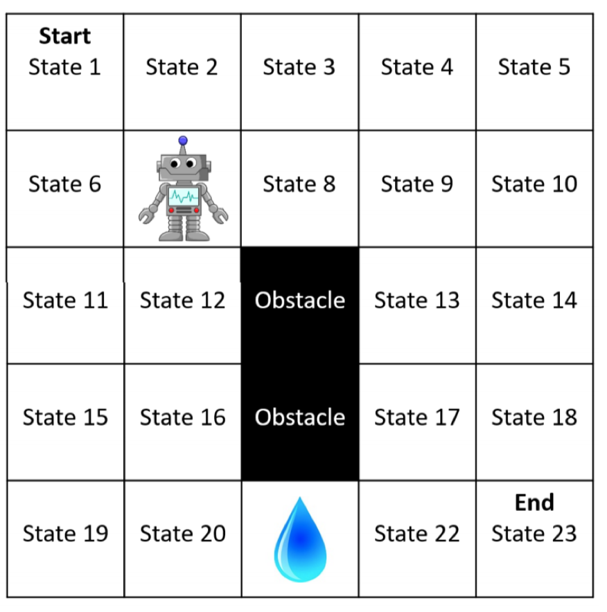
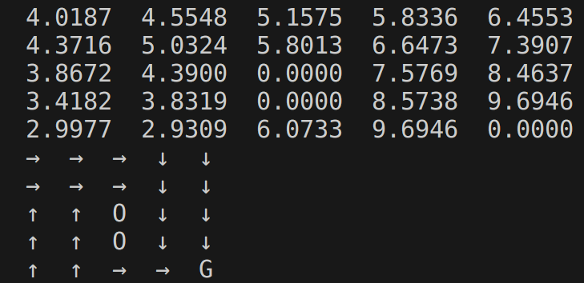
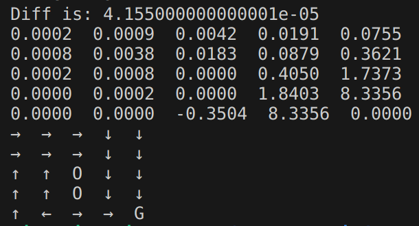
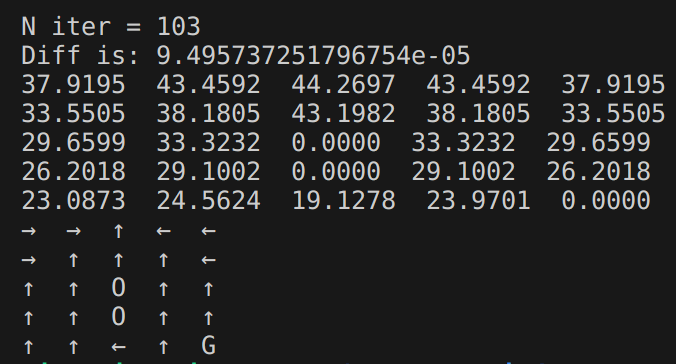
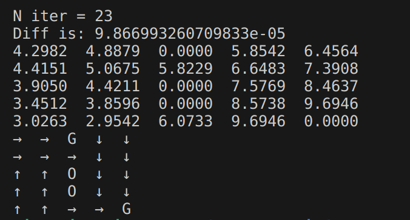
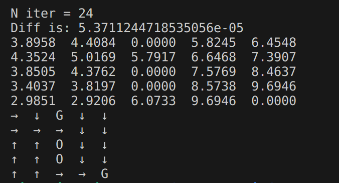

# gridworld-world-value-iteration
Value Iteration algorithm to find the optimal policy for the Gridworld Problem

## About
This repo is derived from a homework assignment from the course COMPSCI 687: Reinforcement Learning, Fall '23 at the University of Massachusetts, Amherst. Following is the gridworld on which the value iteration algorithm is implemented:

<!--  -->

- **State:** The problem involves a 5x5 grid world where each state $(s=(r,c))$ describes the current coordinates/location of the agent. Here, r ranges from 0 to 4, representing the current row, and c ranges from 0 to 4, representing the current column. Refer to Figure [gridworld](/687_gridworld.png) for an example. In this figure, the topmost row is row zero, and the leftmost column is column zero—i.e., *State1* corresponds to (0,0), and *State16* corresponds to (3,1).

- **Actions:** There are four actions: AttemptUp (AU), AttemptDown (AD), AttemptLeft (AL), and AttemptRight (AR).

- **Dynamics:** This is a *stochastic* MDP:
  - With 80% probability, the agent moves in the specified direction.
  - With 5% probability, the agent gets confused and veers to the right with respect to the intended direction.
  - With 5% probability, the agent gets confused and veers to the left with respect to the intended direction.
  - With 10% probability, the agent temporarily breaks and does not move.
  - The grid world is surrounded by walls. If the agent hits a wall, it stays in its current state.
  - There are two *Obstacle states* in this domain: one in state (2,2) and one in state (3,2). If the agent hits an obstacle, it stays in its current state. The agent cannot enter an Obstacle state.
  - There is a *Water state* located at (4,2).
  - There is a *Goal state* located at (4,4).

- **Rewards:** The reward is always 0, except when transitioning to (entering) the Goal state, in which case the reward is 10; or when transitioning to (entering) the Water state, in which case the reward is -10. To model this type of reward function, use a reward function in the form $R(S_t, A_t, S_{t+1})$, instead of $R(S_t, A_t)$. This requires a small modification to the Value Iteration update equation: $v_{i+1}(s) = \max_{a \in A} \sum_{s'} p(s, a, s') \left( R(s, a, s') + \gamma v_i(s') \right)$.

- **Terminal State:** The Goal state is terminal. Any actions executed in this state always transition to $s_\infty$ with reward 0.

- **Discount Rate:**  $\gamma = 0.9$.

- **Initial State:** $S_0=(0,0)$, deterministically.

<!-- [gridworld]: /687_gridworld.png "Gridworld Example" -->

## Experiments

1. **Best Policy with $\gamma = 0.9$ **
   The Value Iteration Algorithm took 25 iterations to stop.
   
   The policy tries to avoid the water state. For the state on the left of the water, the agent goes from the top side over the obstacle. This is so that it can avoid the negative reward that the water state gives. For the Water State and the state to the right of the water state take the AR actions.

   { width="200" }
    

2. **Answer:**
   As seen in figure \ref{P2A}, the policy at state (4,1) changes to AL (from AU). This is because of the new reduced discount, going through water (a negative reward) will cause a lot of reduction in the return. The agent will still get a positive but smaller reward if it totally ignores the water state and goes left. Whereas going up had a (5\%) chance that it would go to the water state and the agent absolutely wants to avoid it.

   Even the value function changed and became close to 0 in the majority of the states. This is because due to the now longer path, the return it can get is very low but still positive. Unfortunately, the water state has a negative value as there is a chance that the agent halts in the same state and gets a negative reward.

   The algorithm this time took just 9 iterations to stop. This might be because due to the reduced $\gamma$, the state values are now reduced a lot and $\delta = 0.0001$ may not be enough to take into account this sensitivity. As evident, a few of the bottom right states have a 0.0000 state value. The state value should have been a non-zero number as the agent will reach the goal state but have a very low (non-zero) return. This is why the algorithm now converges in a fewer number of iterations.

   { width="300" }

3. **Answer:**
   This policy totally ignores the ending GOAL state and in all the states chooses an action that leads the GOLD state. As the GOLD state is non-terminating, the optimal agent wants to stay in the GOLD state as much as it can and collect the GOLD in a never-ending episode. At the GOLD state, the action AU is chosen which will keep the agent in this state for 80+10 = 90\% of times. This can also be observed in the value function that all the nearby states have a value of about \~40.

   This version takes 103 iterations to converge.

   

4. **Answer:**
   Figure \ref{P4A} is the value function and policy identified by the algorithm.

   Now the policy doesn't always want to go the GOLD state. The states on the left side of GOLD don't care that much if they end up in the GOLD state, but the states on the right prefer going down to the original end state. An explanation could be that $\gamma = 0.9$ still causes the original end state to get a higher return for the right states but for the left states, due to more number of steps required, they don't mind the smaller but quicker 5.0 reward.

   

   Experiments with larger $\gamma$:
   - (Figure \ref{P4B}) The first larger $\gamma$ was 0.9133 that changed state (0,1) policy from AR to AD. This might be because increasing the $\gamma$ now makes going for the long term higher reward much more feasible than the quick smaller reward due to the increased discount rate.
   - (Figure \ref{P4C}) The next change is observed when $\gamma$ is taken as 0.935. In this case, the policy at (0,0) changes from AR to AD. Now the policy wants to take even fewer chances to accidentally go to the smaller reward gold state.
   - (Figure \ref{P4D}) The next interesting change is observed at $\gamma = 0.95$. Here the policy at (0,3) changes from AD to AR. This means that the agent doesn't want to risk even the slightest accidentally going in the wrong direction and ensures this by going even further right.

   

5. **Answer:**
   
   Figure \ref{P5A} shows the state value function and the associated policy when a reward of $R = 4.483$ was chosen as GOLD state reward (instead of 5). This was the highest smaller reward value that changed the policy from the one in figure \ref{P4A}. The state (0,1) now chooses AD instead of AR. This means the reward is now small enough that the optimal agent will prefer to take the longer path to get a high reward after a long time.
